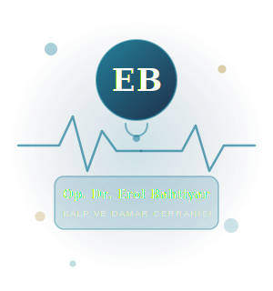

# Op. Dr. Erol Bahtiyar — Kurumsal Web Sitesi

> **İzmir · Kalp ve Damar Cerrahisi Uzmanı**  
> Modern, SEO uyumlu, mobil öncelikli kurumsal doktor web sitesi.

---

## 📁 Proje Yapısı

```
dr-erol-bahtiyar/
├── index.html                  # Ana HTML dosyası (semantik, SEO'lu)
│
├── css/
│   ├── base.css                # CSS değişkenleri & reset
│   ├── layout.css              # Grid, container, section düzeni
│   ├── components.css          # Butonlar, kartlar, form, nav, footer
│   ├── sections.css            # Hero, about, process, conditions, CTA
│   ├── responsive.css          # Tüm breakpoint'ler (1024, 768, 480px)
│   └── animations.css          # Scroll reveal, hover, keyframe animasyonlar
│
├── js/
│   └── main.js                 # Tüm JavaScript (nav, FAQ, form, scroll)
│
└── assets/
    └── svg/
        ├── doctor-illustration.svg   # Ana doktor görseli
        ├── faq-illustration.svg      # FAQ bölümü görseli
        ├── icon-skleroterapi.svg     # Tedavi ikonu
        ├── icon-periferik.svg        # Tedavi ikonu
        ├── icon-bypass.svg           # Tedavi ikonu
        ├── icon-varis.svg            # Tedavi ikonu
        ├── icon-aort.svg             # Tedavi ikonu
        ├── icon-dvt.svg              # Tedavi ikonu
        ├── blog-aort.svg             # Blog kapak görseli
        ├── blog-koroner.svg          # Blog kapak görseli
        └── blog-kapak.svg            # Blog kapak görseli
```

---

## ✨ Özellikler

### SEO
- ✅ Semantic HTML5 etiketleri (`article`, `section`, `nav`, `footer`)
- ✅ Meta title, description, keywords, canonical URL
- ✅ Open Graph (Facebook/LinkedIn paylaşım kartı)
- ✅ Twitter Card desteği
- ✅ **Schema.org Physician** yapılandırılmış verisi (Google'ın doktor olarak tanıması için)
- ✅ `alt` ve `aria-label` ile tam erişilebilirlik
- ✅ `loading="lazy"` ile optimized görsel yükleme

### Mobil Uyumluluk
- ✅ Mobile-first CSS yaklaşımı
- ✅ Hamburger menü + tam mobil navigasyon
- ✅ Breakpoints: 1024px, 768px, 480px
- ✅ `prefers-reduced-motion` desteği
- ✅ Touch-friendly butonlar (min 44px hedef alan)
- ✅ Sticky floating WhatsApp butonu

### Performans
- ✅ Google Fonts preconnect
- ✅ CSS dosyaları bölünmüş (modüler yükleme)
- ✅ IntersectionObserver ile lazy scroll animasyonları
- ✅ Saf Vanilla JS, sıfır bağımlılık
- ✅ Verimli CSS custom properties (değişken sistemi)

### Tasarım
- ✅ Playfair Display + Inter tipografi çifti
- ✅ Navy + Teal + Gold renk paleti
- ✅ CSS Grid ile tüm düzenler
- ✅ Scroll reveal animasyonları (fade, slide)
- ✅ Hover mikro-etkileşimler
- ✅ Inline SVG görseller (harici resim bağımlılığı yok)

---

## 🔧 Kurulum

### Statik Hosting (Önerilen)
```bash
# Repoyu klonla
git clone https://github.com/KULLANICI_ADI/dr-erol-bahtiyar.git

# Klasöre gir
cd dr-erol-bahtiyar

# Herhangi bir HTTP sunucusuyla aç, örneğin:
npx serve .
# veya
python3 -m http.server 8000
```

### Doğrudan Tarayıcıda Açma
`index.html` dosyasını doğrudan tarayıcıda açabilirsiniz. Fontlar CDN'den yüklenir.

---

## 🎨 Özelleştirme Rehberi

### Renkler Değiştirme
`css/base.css` dosyasındaki CSS değişkenlerini düzenleyin:
```css
:root {
  --teal:   #0e7490;  /* Ana marka rengi */
  --navy:   #0b1d3a;  /* Koyu arka plan */
  --gold:   #b8963e;  /* Vurgu rengi */
  --cream:  #f9f7f4;  /* Açık arka plan */
}
```

### Telefon Numarası Güncelleme
Dosyalarda `905304023235` metnini kendi numaranızla değiştirin.

### Doktor Fotoğrafı Ekleme
`assets/svg/doctor-illustration.svg` yerine gerçek fotoğraf kullanmak için  
`index.html` içinde ilgili `` etiketinin `src` değerini değiştirin:
```html
<!-- Eski (SVG) -->


<!-- Yeni (Fotoğraf) -->

```

### İçerik Güncelleme
Tüm içerik `index.html` dosyasında düz HTML olarak bulunmaktadır.  
Herhangi bir metin editörüyle açıp düzenleyebilirsiniz.

---

## 📱 Bölümler

| Bölüm | ID | Açıklama |
|---|---|---|
| Hero | `#home` | Ana sayfa, istatistikler, doktor kartı |
| Güven Çubuğu | — | 5 güven göstergesi |
| Hakkımızda | `#about` | Biyografi, kariyer timeline |
| Tedaviler | `#treatments` | 6 tedavi kartı |
| Süreç | `#process` | 4 adımlı tedavi süreci |
| Belirtiler | `#conditions` | 8 semptom kartı |
| S.S.S. | `#faq` | 6 accordion soru |
| Hasta Yorumları | `#testimonials` | 3 testimonal kartı |
| CTA | — | Randevu çağrısı bölümü |
| Blog | `#blog` | 3 makale kartı |
| İletişim | `#contact` | Form + iletişim bilgileri |
| Footer | — | Linkler, sosyal medya, telif |

---

## 🌐 Deploy Seçenekleri

### GitHub Pages
```bash
# Settings > Pages > Source: main branch / root
# Site: https://KULLANICI.github.io/dr-erol-bahtiyar/
```

### Netlify
```bash
# netlify.toml oluşturmaya gerek yok
# Build command: (boş)
# Publish directory: .
```

### WordPress Entegrasyonu
`index.html` içeriğini bir WordPress custom page template'e yapıştırabilirsiniz.  
CSS ve JS dosyalarını `wp_enqueue_scripts` ile ekleyin.

---

## 📞 İletişim Bilgileri (Sitede Kullanılan)

| Kanal | Bilgi |
|---|---|
| Telefon | +90 530 402 32 35 |
| WhatsApp | +90 530 402 32 35 |
| Instagram | @op.dr.erolbahtiyar |
| Web | opdrerolbahtiyar.com |

---

## 📄 Lisans

Bu proje **Op. Dr. Erol Bahtiyar** adına özel olarak tasarlanmıştır.  
Kaynak kod referans ve öğrenme amaçlı kullanılabilir.

---

*Tasarım & Geliştirme: Claude (Anthropic) · 2026*
